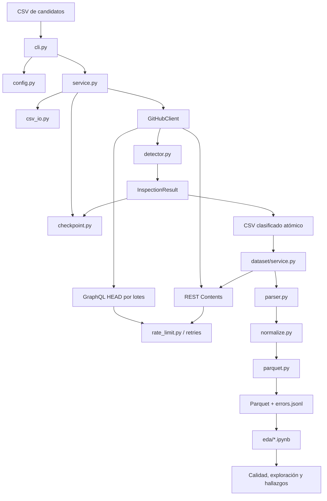

# Arquitectura

## 1. Vista general

El proyecto separa la entrada CSV, la lógica de clasificación, los adaptadores
de GitHub, la persistencia y la construcción del dataset. El CLI coordina las
capas, pero no contiene las reglas de parsing ni las consultas HTTP.

## 2. Capas y responsabilidades

| Capa | Módulos | Responsabilidad |
| --- | --- | --- |
| Entrada y CLI | `cli.py`, `__main__.py` | Comandos, opciones, códigos de salida y progreso. |
| Configuración | `config.py` | `.env`, token secreto, límites y defaults seguros. |
| CSV | `csv_io.py` | Lectura por bloques, validación de `owner/repository`, deduplicación y escritura atómica. |
| Dominio | `models.py`, `github/models.py` | Estados, referencias, listados, errores y métricas tipadas. |
| Orquestación | `service.py` | Resume, lotes, concurrencia acotada, clasificación y persistencia. |
| GitHub | `github/client.py`, `graphql.py`, `rest.py`, `rate_limit.py` | Consultas, parsing de respuestas, reintentos, ETags, fallback y rate limits. |
| Adaptación | `github/adaptive.py` | Ajuste conservador de lote y concurrencia. |
| Checkpoint | `checkpoint.py` | Estados de repositorios y cache de contenido Markdown en SQLite. |
| Dataset | `dataset/extractor.py`, `parser.py`, `normalize.py`, `parquet.py` | Descarga, frontmatter, normalización, validación relacional y Parquet. |
| Observabilidad | `progress.py`, `experiment.py` | Estado de consola y benchmark reproducible. |
| Análisis exploratorio | `eda/01_descripcion_y_calidad.ipynb`, `eda/02_exploracion_y_hallazgos.ipynb` | Lectura de los cuatro Parquet, controles de calidad, visualizaciones y hallazgos; no modifica el dataset. |

## 3. Flujo de clasificación

1. `cli.py` carga `MinerConfig` y crea un `GitHubClient` y un `Checkpoint`.
2. `service.py` inspecciona el CSV en bloques de 10.000 filas por defecto.
3. `csv_io.py` valida `name`, genera claves canónicas en minúsculas y conserva
   el orden de la primera aparición para las consultas.
4. `Checkpoint` separa estados definitivos reutilizables de repositorios que
   deben consultarse.
5. `GitHubClient` usa GraphQL `HEAD` por defecto, con alias por repositorio y
   la información de `rateLimit` en la misma consulta.
6. El resultado de cada lote se normaliza a `WorkflowListing` y después a
   `InspectionResult`.
7. `detector.py` busca el par de nombres base: un `.md` y un `.lock.yml`.
8. El servicio guarda el lote y actualiza el progreso.
9. `write_classifications_atomic` escribe todas las filas y añade
   `uses_ghaw` mediante un temporal y `os.replace`.

La detección es lineal respecto del número de entradas del directorio. No se
descarga el contenido de los archivos durante esta etapa.

## 4. Integración con GitHub

### GraphQL

El modo `head` construye una consulta con aliases y lee el árbol de
`.github/workflows` desde `HEAD`. Los modos `default-branch` y `two-phase` se
mantienen para experimentación y comparación.

Las respuestas se procesan aunque contengan datos y errores parciales. Los
aliases con error retryable se vuelven a consultar; cuando corresponde, el
cliente divide el lote y puede usar REST como fallback individual.

### REST

REST lista el directorio con Contents API y obtiene el contenido de cada
Markdown del dataset. Un `404` al listar se desambigua con metadata para
distinguir repositorio inexistente de un directorio vacío. Los ETags permiten
revalidar respuestas sin descargar contenido innecesariamente.

### Reintentos y rate limit

`rate_limit.py` combina valores del cuerpo GraphQL con headers REST, interpreta
`Retry-After`, espera el reset cuando `remaining` es cero y aplica backoff
acotado. Los estados de error permanecen explícitos y no se convierten en
`NO_MATCH`.

## 5. Estados y persistencia

Los estados de clasificación son:

| Estado | `uses_ghaw` | Reutilizable con `--resume` | Significado |
| --- | ---: | ---: | --- |
| `MATCH` | `True` | Sí | Se detectó el par GH-AW. |
| `NO_MATCH` | `False` | Sí | Repositorio accesible sin el par. |
| `NOT_FOUND` | nulo | Sí | Repositorio inexistente. |
| `FORBIDDEN` | nulo | No | GitHub denegó el acceso. |
| `RATE_LIMITED` | nulo | No | Se agotó o bloqueó el límite. |
| `UNAVAILABLE` | nulo | No | Error temporal de disponibilidad. |
| `ERROR` | nulo | No | Error no resuelto. |

La tabla `repository_cache` guarda el estado de clasificación y los metadatos
de la última inspección. La cache de contenido del dataset usa el repositorio,
el path y `blob_sha`; si el SHA no cambia, el Markdown se reutiliza.

## 6. Flujo del dataset

`dataset/service.py` carga solo repositorios con `uses_ghaw=True` o `uses_ghaw=1`,
deduplica las
referencias y ejecuta extracciones acotadas. Para cada repositorio:

1. Lista `.github/workflows/` con REST.
2. Filtra archivos y conserva solo nombres terminados en `.md`.
3. Consulta SQLite por `blob_sha`.
4. Descarga el contenido faltante.
5. Calcula `content_sha256` y separa frontmatter de body.
6. Normaliza cada clave YAML a un `key_path` determinista y JSON válido.
7. Registra errores en `errors.jsonl` sin descartar los registros válidos.
8. Valida claves primarias/foráneas y escribe las cuatro tablas Parquet.

Los identificadores de repositorio, archivo y campo son hashes SHA-256
deterministas; no dependen del orden de ejecución. Las tablas y columnas están
documentadas en [data-dictionary.md](data-dictionary.md).

## 7. Rendimiento y límites

- CSV: lectura por bloques, con 10.000 filas por defecto.
- GraphQL: lote configurable entre 1 y 100 aliases.
- Concurrencia: entre 1 y 4; el default es 1.
- Adaptación: solo usa las políticas permitidas y divide ante fallos elegibles.
- HTTP: un cliente HTTPX de larga vida por ejecución.
- Salida: escritura atómica del CSV y validación previa del dataset.

GraphQL point cost y número de solicitudes HTTP son métricas distintas. El
benchmark de `experiment.py` las reporta por separado.

## 8. Fronteras de prueba

Los tests cubren el detector puro, modelos Pydantic, CSV, SQLite, consultas
GraphQL, parsing de errores parciales, retries, rate limits, ETags, REST,
resume, parsing YAML, normalización, Parquet y la consola de progreso. Los
tests de red usan `httpx.MockTransport`; no requieren llamadas reales a GitHub.

## 9. Flujo de análisis exploratorio

La carpeta `eda/` consume únicamente el artefacto Parquet generado por la capa
Dataset. El snapshot documentado contiene 374 repositorios, 1.541 archivos
Markdown, 60.038 nodos de frontmatter y 1.541 bodies.

`01_descripcion_y_calidad.ipynb` carga de forma independiente las cuatro tablas
y valida tamaños, tipos PyArrow y pandas, nulos, strings vacíos, claves
primarias, referencias, cardinalidades archivo-body, JSON, estados de parsing,
paths YAML escapados, tipos heterogéneos y longitud del body.

`02_exploracion_y_hallazgos.ipynb` vuelve a cargar las tablas y deriva en
memoria `body_features`, `frontmatter_file_summary`, `file_features` y
`repository_features`. Agrega `frontmatter_fields` a nivel `file_id` antes de
unirlo con bodies para evitar doble conteo, usa joins validados y conserva los
cinco repositorios sin archivos. Explora la cobertura de `engine`, el path
exacto `timeout-minutes`, los triggers `on.*`, la longitud del body y dos
relaciones descriptivas.

Los notebooks detectan el directorio por defecto o aceptan
`CHIKIMINER_EDA_DATA_DIR`; las variables derivadas viven en memoria y las
tablas Parquet no se sobrescriben. El grupo opcional `eda` añade JupyterLab,
`ipykernel` y `seaborn`; pandas, PyArrow y Matplotlib ya forman parte del
entorno requerido.
