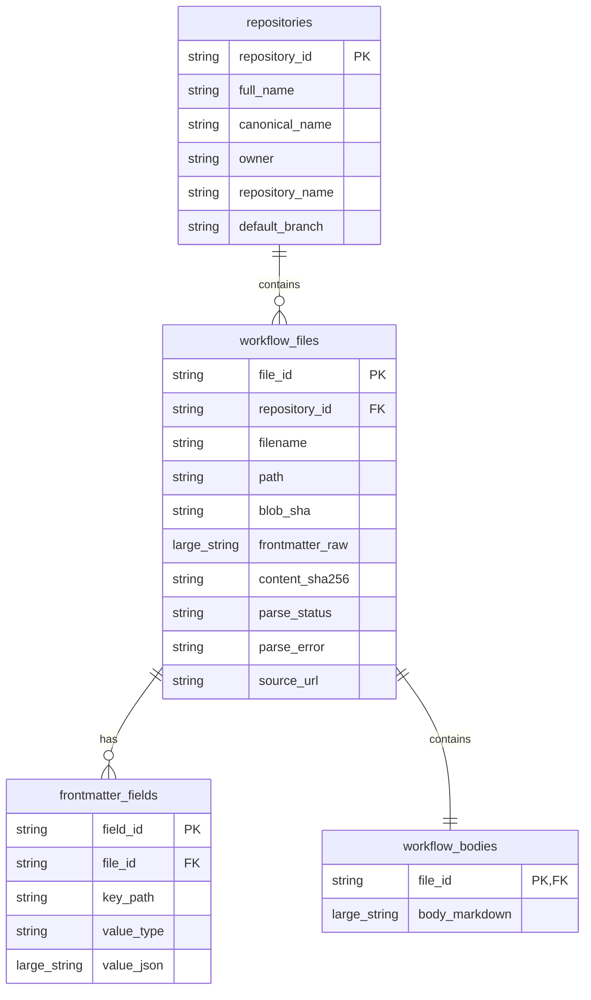

# Modelo entidad-relación

El dataset representa repositorios GH-AW y todos sus archivos Markdown
descubiertos en `.github/workflows/`. Los identificadores son hashes SHA-256
deterministas; no dependen del orden de ejecución.

## Cardinalidades

- Un `repository` puede tener cero o muchos `workflow_files`.
- Un `workflow_file` puede tener cero o muchos `frontmatter_fields`.
- Cada `workflow_file` descargado tiene exactamente un `workflow_body`, incluso
  cuando el body está vacío o el frontmatter es inválido.
- Un archivo sin frontmatter no genera fields, pero conserva su body y su
  estado `no_frontmatter`.
- Los errores de listado, descarga o parsing se escriben aparte en
  `errors.jsonl` y no se convierten en falsos registros válidos.
